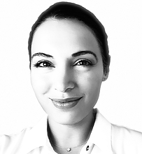
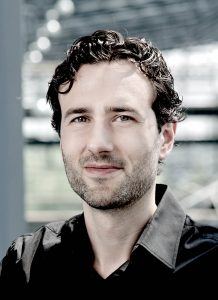
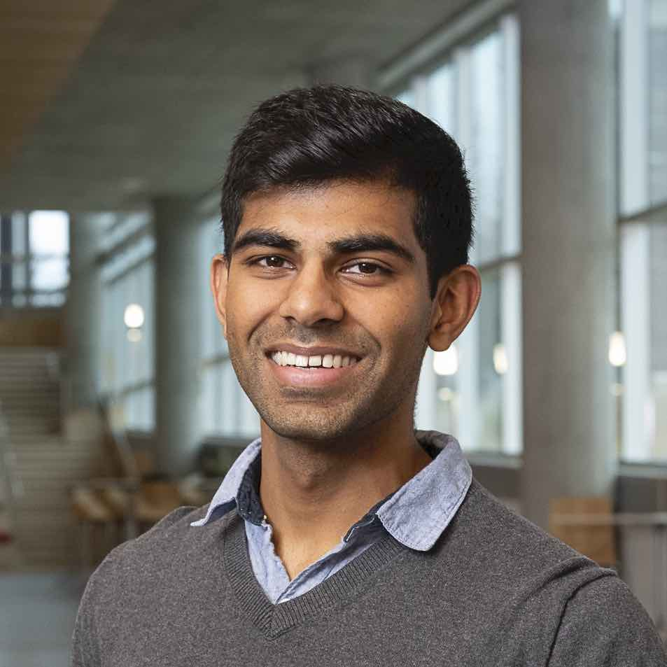
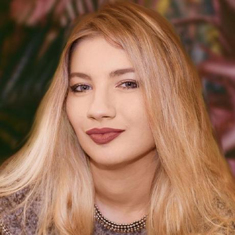
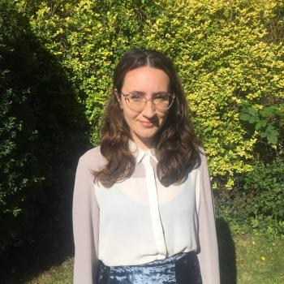

<!-- Text can be **bold**, _italic_, or ~~strikethrough~~.

[Link to another page](./another-page.html).

There should be whitespace between paragraphs.

There should be whitespace between paragraphs. We recommend including a README, or a file with information about your project. -->

<!-- > This is a blockquote following a header.
>
> When something is important enough, you do it even if the odds are not in your favor. -->


<!-- ```js
// Javascript code with syntax highlighting.
var fun = function lang(l) {
  dateformat.i18n = require('./lang/' + l)
  return true;
}
```

```ruby
# Ruby code with syntax highlighting
GitHubPages::Dependencies.gems.each do |gem, version|
  s.add_dependency(gem, "= #{version}")
end
``` -->

# Workshop summary

Long-term climate projections emphatically agree that we are headed for a warming world. However, much uncertainty remains in the expected magnitude of warming, the change in precipitation patterns, and the frequency of climate extremes. This uncertainty undermines the ability of policymakers and economic decision-makers to build consensus around measures for mitigating and adapting to a potentially irreversible, multi-trillion-dollar problem. Although improved understanding of physics has been essential to climate model improvement, reducing remaining uncertainty will require overcoming the increased computational expense of explicitly representing these physics at sub-resolution scales. Machine learning (ML) methods could provide tools for emulating subgrid climate processes at operationally viable costs. However, engaging the machine learning community on this task has been inhibited by high barriers of entry due to a lack of well-documented training data and relevant, easy-to-use workflows. [ClimSim](https://leap-stc.github.io/ClimSim/), a recently released large multi-scale dataset for hybrid physics-ML climate emulation, was our first step toward filling this gap. The first part of the workshop features peer-reviewed contributions based on the ClimSim data set as part of a public challenge that we will organize before the workshop. The workshop's second part will feature experts' presentations on several frontiers of earth system modeling where machine learning is driving progress. It aims to cover methodological advances and open challenges that are fundamental for a wide range of disciplines relevant to improving climate predictability.

# Modality

Hybrid

# Schedule

This workshop is divided into 5 main sections:

1. **Introduction**: This section sets the theme of the workshop and also reviews ClimSim, a paper and dataset accepted in the Neurips 2023 Datasets and Benchmarks Track used for the competition.

2. **Spotlight ClimSim submissions**: This section covers spotlight talks and a poster session for exceptional submissions to the upcoming ClimSim competition.

3. **Advancing the Domain**: This section covers cases of how machine learning is changing the underlying domain science of earth system modeling.

4. **New Directions**: This section discusses ways in which advancements in physics-guided machine learning can manifest in future breakthroughs for earth system modeling.

5. **Panel Discussion**: The panel discussion seeks to bring everything together for a thoughtful discussion on how machine learning will continue to advance the future of earth system modeling given existing opportunities for low-hanging fruit and promising new directions.

_All listed speakers have been confirmed._ The coffee breaks, poster sessions, Q&A sessions, and panel discussion will serve as opportunities for broad discussion. Invited speakers will be expected to give 20-minute talks with 5 minutes left for Q&A, where questions are taken from invited speakers. For the panel discussion, questions will be taken from online and in-person attendees.


| Time         | Event                                                                                                      | Section                       |               
|:-------------|:-----------------------------------------------------------------------------------------------------------|:------------------------------| 
| 9:00         | Introduction and Opening Remarks [[Jerry Lin](https://www.linkedin.com/in/jerry-lin-3a8801104/)]           | Introduction                  |
| 9:10         | Invited Talk 1 [[Maria Molina](https://mariajmolina.github.io/), Keynote]                                  | Introduction                  |
| 9:35         | Invited Talk 2 [[Sungduk Yu](https://www.linkedin.com/in/sungduk-yu/), ClimSim introduction and updates]   | Introduction                  |
| 10:00        | ClimSim Poster Session                                                                                     | Spotlight ClimSim Submissions |
| 10:30        | Coffee Break / Social                                                                                      | Break                         |
| 11:00        | ClimSim Spotlight Talk 1                                                                                   | Spotlight ClimSim Submissions |
| 11:12        | ClimSim Spotlight Talk 2                                                                                   | Spotlight ClimSim Submissions |
| 11:24        | ClimSim Spotlight Talk 3                                                                                   | Spotlight ClimSim Submissions |
| 11:36        | ClimSim Spotlight Talk 4                                                                                   | Spotlight ClimSim Submissions |
| 11:48        | ClimSim Spotlight Talk 5                                                                                   | Spotlight ClimSim Submissions |
| 12:00        | Networking Lunch                                                                                           | Lunch                         |          
| 13:30        | Advancing the Domain Invited Talk [[Yilun Han](https://www.researchgate.net/profile/Yilun-Han-4)]          | Advancing the Domain          |
| 13:55        | Advancing the Domain Invited Talk [[Kara Lamb](https://datascience.columbia.edu/people/kara-lamb/)]        | Advancing the Domain          |
| 14:20        | Advancing the Domain Invited Talk [[Marcus van Lier-Walqui](https://ccsr.columbia.edu/people/marcus-van-lier-walqui)]   | Advancing the Domain          |
| 14:45        | Advancing the Domain Invited Talk [[Stephan Mandt](http://www.stephanmandt.com/)]                          | Advancing the Domain          |
| 15:10        | New Directions Invited Talk [[Rose Yu](https://roseyu.com/)]                                               | New Directions                |
| 15:35        | New Directions Invited Talk [[Aditi Krishnapriyan](https://a1k12.github.io/)]                              | New Directions                |
| 16:00        | New Directions Invited Talk [[Nils Thuerey](https://ge.in.tum.de/about/n-thuerey/)]                        | New Directions                |
| 16:25        | New Directions Invited Talk [[Aditya Grover](https://aditya-grover.github.io/)]                            | New Directions                |
| 16:50        | New Directions Invited Talk [[David Rolnick](https://davidrolnick.com/)]                                   | New Directions                |
| 17:15        | Coffee Break / Social                                                                                      | Break                         |
| 17:45        | Panel Discussion [[Mike Pritchard](https://www.linkedin.com/in/mikepritchard/) + [Stephan Mandt](http://www.stephanmandt.com/) + [Galen McKinley](https://people.climate.columbia.edu/users/profile/galen-mckinley) + [Rose Yu](https://roseyu.com/) + [Maria Molina](https://mariajmolina.github.io/)], moderated by [Maja Rudolph](http://maja-rita-rudolph.com/)              | Panel Discussion              |
| 18:30        | End                                                                                                        | End                           |

# Invited Speakers and panelists

**Maria Molina (speaker + panelist)**



[Maria J. Molina (she/her)](https://mariajmolina.github.io/) is an assistant professor of atmospheric and oceanic science at the University of Maryland, College Park, USA. She is also affiliated with the University of Maryland Institute for Advanced Computer Studies (UMIACS) and the National Center for Atmospheric Research (NCAR). Her research group focuses on better understanding Earth system predictability in a changing climate, along with societal links, using machine learning and numerical physics-based modeling systems. Maria is a member of the World Climate Research Programme (WCRP) Scientific Steering Group for the Earth System Modelling and Observations (ESMO) Core Project, serves as Vice Chair of the Committee on Artificial Intelligence Applications to Environmental Science of the American Meteorological Society (AMS), and is a member of the AMS Board on Representation, Accessibility, Inclusion, and Diversity.

**Sungduk Yu (speaker)**


[Sungduk Yu (he/him)](https://www.linkedin.com/in/sungduk-yu/) is currently a project scientist at the University of California, Irvine, where he has been working on developing and integrating machine learning algorithms for earth system models. His main work has been on developing sub-grid physics emulators for convection and aerosol activation and on integrating Python-based ML models in Fortran-written earth system models. He is the lead author and active maintainer for ClimSim. Before this current position, he studied various topics in climate dynamics, including tropical precipitation, global energy transport and extreme El Niño events, during his postdoctoral training at Yale University and Ph.D. at the University of California, Irvine.

**Yilun Han (speaker)**


[Yilun Han (he/him)](https://www.researchgate.net/profile/Yilun-Han-4) is a postdoctoral research fellow at Tsinghua University Center for Earth System Science. His work focuses on developing machine-learning based parameterizations for atmospheric moist physics and radiation processes within Global Climate Models (GCM). His research also covers generalizability of these parameterization schemes to different climate scenarios and stable integration of resulting coupled climate models. At the time of this writing, his latest work is the current state-of-the-art for deep learning convective parameterizations coupled to a GCM.

**Kara Lamb (speaker)**


[Kara Lamb (she/her)](https://datascience.columbia.edu/people/kara-lamb/) is an Associate Research Scientist at Columbia University in the NSF Learning the Earth with Artificial Intelligence and Physics (LEAP) Center and collaborates with researchers at NASA GISS on the NASA Digital Twins for Climate Science Project. Her research lies at the intersection of observations (from laboratory and field studies) and high-resolution modeling, with the goal of improving climate model parameterizations of aerosol and cloud processes. She combines traditional process-based approaches with data science, scientific machine learning, and reduced-order modeling. She was on the science team for the NASA KORUS-AQ and AToM aircraft campaigns and the NOAA FIREX Firelab study, was the lead mentor for the 2022 Frontier Development Laboratory Europe challenge on Aerosols, and is a member of the AMS STAC Committee on AI Applications to Environmental Science.

**Marcus van Lier-Walqui (speaker)**


[Marcus van Lier-Walqui (he/him)](https://ccsr.columbia.edu/people/marcus-van-lier-walqui) is an Associate Research Scientist and has worked at CCSR and NASA/GISS since 2013, and is a Co-Investigator of the NSF Learning the Earth with Artificial Intelligence and Physics (LEAP) Center. His expertise is in using Bayesian inference methods to estimate parameters and quantify uncertainty in physical models of clouds and precipitation. This involves making comparison between observations, such as advanced polarimetric and profiling radars, and model simulations of weather. These efforts leverage the rich microphysical information content of observational systems to improve our understanding and model representation of cloud and precipitation processes. Furthermore, the Bayesian methodologies used allow for robust estimation of uncertainty that can inform forecast representations of physical process uncertainty, e.g. via probabilistic forecast ensembles.

**Stephan Mandt (speaker + panelist)**


[Stephan Mandt (he/him)](http://www.stephanmandt.com/) is an Associate Professor of Computer Science and Statistics at the University of California, Irvine. From 2016 until 2018, he was a Senior Researcher and Head of the statistical machine learning group at Disney Research in Pittsburgh and Los Angeles. He held previous postdoctoral positions at Columbia University and Princeton University. Stephan holds a Ph.D. in Theoretical Physics from the University of Cologne, where he received the German National Merit Scholarship. He is furthermore a recipient of the NSF CAREER Award, the UCI ICS Mid-Career Excellence in Research Award, the German Research Foundation's Mercator Fellowship, a Kavli Fellow of the U.S. National Academy of Sciences, a member of the ELLIS Society, and a former visiting researcher at Google Brain. Stephan is an Action Editor of the Journal of Machine Learning Research and Transaction on Machine Learning Research and currently serves as Program Chair for AISTATS 2024.

**Rose Yu (speaker + panelist)**


[Dr. Rose Yu (she/her)](https://roseyu.com/) is an assistant professor at the University of California San Diego, Department of Computer Science and Engineering. Her research focuses on advancing machine learning techniques for large-scale spatiotemporal data analysis, with applications to sustainability, health, and physical sciences. A particular emphasis of her research is on physics-guided AI which aims to integrate first principles with data-driven models. Among her awards, she has won Army ECASE Award, NSF CAREER Award, Hellman Fellow, Faculty Research Award from JP Morgan, Facebook, Google, Amazon, and Adobe, Several Best Paper Awards, Best Dissertation Award at USC, and was nominated as one of the ’MIT Rising Stars in EECS’. 

**Aditi Krishnapriyan (speaker)**


[Aditi Krishnapriyan (she/her)](https://a1k12.github.io/) is an assistant professor of Chemical Engineering and EECS at UC Berkeley where she is also a member of Berkeley AI Research (BAIR) and part of the AI+Science group in EECS and the theory group in Chemical Engineering. She is interested in developing methods in machine learning that are driven by the distinct challenges and opportunities in the natural sciences, with particular interest in physics-inspired machine learning methods. Some areas of exploration include approaches to incorporate physical inductive biases (such as symmetries, conservation laws) into ML models to improve generalization for scientific problems, the advantages that ML can bring to classical physics-based numerical solvers (such as through end-to-end differentiable frameworks and implicit layers), and better learning strategies for distribution shifts in the physical sciences.

**Nils Thuerey (speaker)**



[Nils Thuerey (he/him)](https://ge.in.tum.de/about/n-thuerey/) is an associate professor at the computer science department of the Technical University of Munich (TUM) where he leads a research group working on deep learning methods for physical simulations, with an emphasis on fluid flow problems. He has co-authored a freely available, Jupyter based textbook on physics-based deep learning, and his group has pioneered novel methods for improving the stability, rollout, and physical consistency of neural network-based PDE solvers. He is especially interested in solvers that employ traditional numerics alongside learned components, and, more recently, in leveraging diffusion modelling for improved neural simulations.

**Aditya Grover (speaker)**


[Aditya Grover (he/him)](https://aditya-grover.github.io/) is an assistant professor of computer science at UCLA. He leads the Machine Intelligence (MINT) group, where they develop AI systems that can interact and reason with limited supervision. His current research is at the intersection of generative models and sequential decision making, and their application for scientific reasoning. He also grounds this research via the ML4Climate initiative, where his group develops data-driven methods and software to accelerate scientific discovery for climate change applications. His research has been awarded the best paper award at NeurIPS, the ACM SIGKDD Doctoral Dissertation Award, the AI Researcher of the Year Award by Samsung, and the Kavli Fellowship by the US National Academy of Sciences. Aditya received his postdoctoral training from UC Berkeley, PhD from Stanford, and bachelors from IIT Delhi, all in computer science.

**David Rolnick (speaker)**


[David Rolnick (he/him)](https://davidrolnick.com/) is an Assistant Professor and Canada CIFAR AI Chair in the School of Computer Science at McGill University and at Mila Quebec AI Institute, where his work focuses on applications of machine learning to help address climate change. He is a Co-founder and Chair of Climate Change AI and Scientific Co-director of Sustainability in the Digital Age. Dr. Rolnick received his Ph.D. in Applied Mathematics from MIT. He is a former NSF Mathematical Sciences Postdoctoral Research Fellow, NSF Graduate Research Fellow, and Fulbright Scholar, and was named to the MIT Technology Review's 2021 list of "35 Innovators Under 35."

# Organizers

**Jerry Lin (UC Irvine)**


[Jerry Lin (he/him)](https://www.linkedin.com/in/jerry-lin-3a8801104/) is a PhD candidate at UC Irvine and graduate research assistant in the NSF Learning the Earth with Artificial Intelligence and Physics (LEAP) Center working on neural network emulators of convection and radiation coupled inside climate models. His current work involves developing and coupling stochastic parameterizations, and he previously developed push-button capabilities for multi-hundred ensemble tests for coupled hybrid physics-ML climate simulations. He is a co-author and active maintainer for ClimSim and an organizer for the upcoming Kaggle competition. He has previously managed a student-run data science course at UC Berkeley. 

**Ritwik Gupta (UC Berkeley)**



[Ritwik Gupta (he/him)](https://ritwikgupta.me/) is a Ph.D. student at the University of California, Berkeley. His research focus is on computer vision for humanitarian assistance and disaster response, as well as the development of policies related to the use of machine learning in developing areas. His research has been used widely by organizations such as the United Nations, CAL FIRE, and the International Red Cross. Ritwik is a Graduate Fellow with the Berkeley Risk and Security Lab, a Research Fellow at Berkeley’s Human Rights Center, and a Fellow at Berkeley’s AI Policy Hub. Ritwik is the Director of the Berkeley AI Research Climate Initiative which brings together researchers to work on AI research through the lens of climate change and helps to translate that work into real-world applications.

**Margarita Geleta (UC Berkeley)**



[Margarita Geleta (she/her)](https://margaritageleta.github.io/) is a Ph.D. student at the University of California, Berkeley, affiliated with Berkeley AI Research (BAIR). She has led research on multimodal deep steganography at the Image Processing Group (UPC), developed algorithms for genotype compression, simulation, and imputation in the Bustamante Lab at the Stanford School of Medicine, and interned at Amazon.com as an Applied Scientist. In addition to teaching at UPC, UC Irvine, and tech academies, Margarita has organized workshops and career fairs with +200 participants and co-organized Europe's biggest student hackathon with +700 participants.

**Mohamed Aziz Bhouri (Columbia University)**


[Mohamed Aziz Bhouri (he/him)](https://gentinelab.eee.columbia.edu/people/aziz-bhouri) is an NSF AGS-PRF fellow postdoctoral researcher at Columbia University in Pr. Pierre Gentine’s lab. His work focuses on physics-informed machine learning, differentiable programming for systems calibration and Bayesian inference, with experience in Finite Element methods and model order reduction techniques. Dr. Bhouri is also affiliated with NSF Science and Technology Center “Learning the Earth with Artificial Intelligence and Physics” (LEAP) and  “Multiscale Machine Learning In Coupled Earth System Modeling” (M2LInES) project.

**Tian Zheng (Columbia University)**


[Tian Zheng (she/her)](https://stat.columbia.edu/~tzheng/) is Professor and Department Chair of Statistics at Columbia University. She is Chief Convergence Officer and Education Director of the NSF Science Technology Center “Learning the Earth with AI and Physics”. In her research, she develops novel methods for exploring and understanding patterns in complex data from different application domains such as biology, psychology, climate modeling, etc. In 2016, she designed Applied Data Science, a project-based learning course that offers mini data-intensive challenges. She was Associate Director for Education at Columbia’s Data Science Institute from 2017 to 2020 and a faculty advisor for Columbia Statistics Club from 2016 to 2021. She has organized and served as a judge in 10+ data competitions and hackathons. 

**Yongquan Qu (Columbia University)**


[Yongquan Qu (he/him)](https://yongquan-qu.github.io/) is a Ph.D. candidate at Columbia University. His primary research delves into the intersection of scientific machine learning and computational methods, aiming to enhance the modeling and understanding of turbulence in the atmospheric boundary layer. He also works on developing a hybrid framework that integrates probabilistic machine learning with data assimilation in the context of climate projections. He is a graduate research assistant of the NSF Science and Technology Center “Learning the Earth with Artificial Intelligence and Physics” (LEAP). He is also affiliated with the “Multiscale Machine Learning In Coupled Earth System Modeling” (M2LInES) project - an international collaborative project to improve climate models with scientific machine learning.

**Laura Mansfield (Stanford University)**



[Laura Mansfield (she/her)](https://profiles.stanford.edu/laura-mansfield) is a postdoctoral researcher at Stanford University. Her research focuses on Bayesian statistics and machine learning methods for the development of subgrid-scale gravity wave parameterization in climate models, in order to improve the representation of stratospheric dynamics. She works on both the calibration of conventional gravity wave parameterizations and also on replacing these entirely with novel machine learning alternatives. She is particularly interested in uncertainty quantification of climate models. Previously, she completed her PhD in 2021 at the University of Reading, following the Mathematics of Planet Earth MRes at University of Reading in 2017 and an MSci in Physics at Imperial College London in 2016.

**Maja Rudolph (Bosch Research)**


[Maja Rudolph (she/her)](http://maja-rita-rudolph.com/) is a Senior Research Scientist at the Bosch Center for Artificial Intelligence, where she works in the field of deep probabilistic modeling. She completed her Ph.D. in Computer Science at Columbia University, advised by David Blei, in 2018. Maja holds an MS in Electrical Engineering from Columbia University and a BS in Mathematics from MIT. Her research lies at the intersection of Bayesian machine learning and deep learning, with a focus on deep probabilistic sequence models, neural transformation learning, and embedding methods. 

# Anticipated audience size:

400

# Plan to get an audience for a workshop (advertising, reaching out, etc.):

We plan to advertise via social media channels (Twitter/Mastodon/BlueSky, LinkedIn, etc.), the Learning the Earth with Artificial Intelligence and Physics (LEAP) NSF Science and Technology Center, the Multiscale Machine Learning in Coupled Earth System Modeling (M2LiNES), the Frontier Development Lab, the Berkeley AI Research Climate Initiative, the Climate Change AI community platform, and internal channels at universities with high representation of under-represented minorities in STEM. 

# Diversity Commitment:

We aimed to achieve diversity in various aspects when we selected speakers, panelists, and organizers. Our speakers, panelists, and organizers are a mix of domain scientists in earth sciences and machine learning experts representing diverse backgrounds, nationalities, and locations. They have different levels of seniority in academia and industry, and they balance their expertise and interest in theory and applied machine learning. This will ensure a lively and balanced panel discussion.

# Access:

To maximize engagement and access, we will be pursuing a hybrid format. Talks will be streamed and recorded on YouTube, and accepted papers and posters will be uploaded online. All invited speakers will attend in person, but, to improve accessibility for junior researchers, those presenting accepted contributed talks and posters will have the option to present virtually. Workshop organizers will take questions from an online Q&A for the panel discussion. When assessing submissions, workshop organizers belonging to the same institution as that of the submitter(s) will not be involved in assessment. If necessary, speakers/panelists will be asked to volunteer to assist in assessment.

# Previous related workshops

- AGU Fall Meeting “Machine Learning Subgrid-Scale Parameterizations for Earth System Modeling” Session (2023)
- AMS 23rd Conference on Artificial Intelligence in Environmental Science (2024), AI 4 Earth Sciences (ICLR 2020)
- AI for Earth and Space Science (ICLR 2022), Neurips Tackling Climate Change with Machine Learning 2019-2023
- Neurips Machine Learning and the Physical Sciences (2017-2023)
- Scientific Machine Learning Symposium (UCSD, 2023)

This workshop distinguishes itself from previous workshops by orienting itself around a public competition meant to draw in machine learning experts on a well-defined, long-standing climate science problem using a dataset and paper accepted in the 2023 Neurips Datasets and Benchmarks track. This serves as a foothold for machine learning experts to help drive progress in other open problems in earth system modeling. We also intentionally invited experts at the direct intersection of physics (turbulent flow, molecular dynamics, etc.) and machine learning to provide fundamental, first-principles insight into the challenges of generalizing data-driven 
